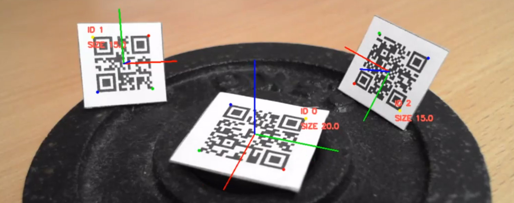

# QR Code Augmented Reality

Repository for code related to [my Bachelor's thesis](https://www.vutbr.cz/studenti/zav-prace/detail/124934) (in Czech) written in 2020. Created additionally, to make the code more easily available. For a demonstration see the [video](https://youtu.be/HYNjtVIEAbo).

## Table of contents
- [About](#about)
- [Module](#module)
- [Sample usage script](#sample-usage-script)
- [Demonstration application](#demonstration-application)
- [Dependencies](#dependencies)
- [Notable sources](#notable-sources)
- [Other notes](#other-notes)
- [License](#license)


## About

The project deals with the usage of QR Codes for camera pose estimation for Augmented Reality applications. It consists of the main module, its sample usage script, and a simple demonstration application.

The main features are:  
- easy usage of the module,
- possibility of multiple QR Codes in the scene,
- separation of detection and decoding,
- robust 6DOF pose estimation under a variety of angles (after the first successful decode).

Information about the real dimensions of the QR Code is intended to be included at the end of its content. For example `sample_text S30` for QR Code of 30×30 mm (alternatively see [sample QR Code](photo_for_demo_A4_print_ready.pdf)).


 

### Module

The module is represented by [*qr_code_augmented_reality.py*](qr_code_augmented_reality.py) and is in relevant files imported as `qar`. The intended usage consists of three functions:

```
qar.init()
qar.detectCodes()
qar.estimatePose()
```

Additionally, four visualization functions are also available, mainly for parameter tuning and debugging. These are:

```
qar.drawCodes()
qar.drawCandidateEvaluation()
qar.drawAxes()
qar.visualizeDetectorSteps()
```

After the first successful decoding of a detected QR Code, an ID is assigned. Further, the specific Code is tracked by a simple centroid tracker, while the detection algorithm still runs, identifying individual corners for camera pose estimation. The parameters of the detector are commented on in the Python code itself.

### Sample usage script

The sample usage script is represented by [*qar_pose_estimation_sample.py*](qar_pose_estimation_sample.py). For precise pose estimation, the user must perform camera calibration. Thus, provide [*camera_matrix.npy*](camera_matrix.npy) and [*distortion_coefficients.npy*](distortion_coefficients.npy) of the specific camera. 

### Demonstration application

The simple demo application [*qar_demo_app.py*](qar_demo_app.py) represents a tool for working with PCBs. Where the QR Code is assumed to be attached to the PCB (like in the [*ready for print example*](photo_for_demo_A4_print_ready.pdf)), while its content refers to a text file saved on a local server ([*simple_local_server.py*](simple_local_server.py)). This text file contains instructions for highlighting components by defining relative positions and URL to its datasheet (see [*demo_syntax.txt*](server_files/demo_syntax.txt) and [*uno.txt*](server_files/uno.txt)). The app only works with light QR Codes on a dark background.

## Dependencies

The project was created with Python 3.8 and the following dependencies (all listed in PyPi):
- OpenCV 4.2.0.34
- NumPy 1.18.5
- PyZBar 0.1.8
- Centroid tracker 0.0.9

## Notable sources

- The implemented detection algorithm is based on the [Dsynflo blogpost](http://dsynflo.blogspot.com/2014/10/opencv-qr-code-detection-and-extraction.html). With improvements resulting in robust identification of the corners under more camera angles.

- The easy usage of the module was inspired by the ArUco contribution module used in the [OpenCV tutorial](https://docs.opencv.org/4.x/d5/dae/tutorial_aruco_detection.html).

## Other notes

- Further algorithm insights and references can be found in the thesis (link at the [top](#qr-code-augmented-reality)).

- The QR Code should have a black bit at every corner for accurate pose estimation. 

- The used [simple centroid tracker](https://pyimagesearch.com/2018/07/23/simple-object-tracking-with-opencv/) can be prone to ID substitution in certain situations.

- The proposed solution can be suitable for some applications. But generally speaking, the combination of QR codes and different reference marks are often a better solution.

- The whole solution would benefit from rewriting it in C++ and optimizations.

## License

Licensed under the [MIT License](LICENSE).

QR Code is a registered trademark of DENSO WAVE INCORPORATED.